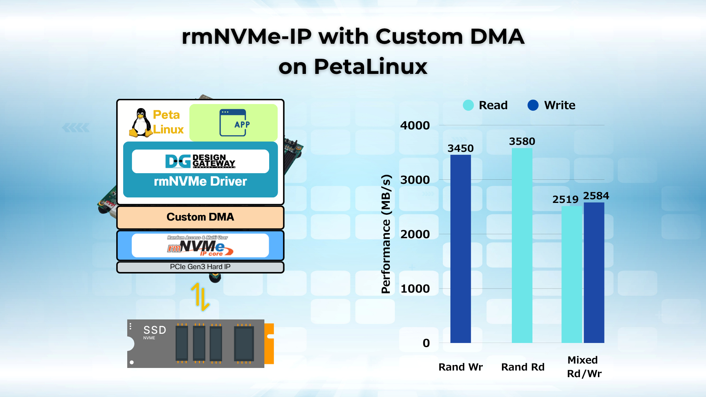

# rmNVMe-IP with Custom DMA on PetaLinux Demo

## Overview
This document demonstrates how to achieve 3000++ MB/s NVMe performance with full Linux filesystem access using rmNVMe-IP on a PetaLinux-based FPGA demo from Design Gateway - **DG rmNVMe-IP PetaLinux demo**.



## Introduction
The **rmNVMe-IP** with Custom DMA on PetaLinux demo showcases a high-performance random-access NVMe host system built on a custom DMA datapath, delivering over 3000 MB/s while operating as a fully Linux-compatible block device. Users can evaluate I/O performance, verify data integrity, and execute NVMe management commands directly from the terminal.

## Comparison: DG rmNVMe-IP vs DG NVMe-IP on PetaLinux 
| **IP Name** | **rmNVMe-IP** (this demo) | **NVMe-IP** |
|--------|---------------------------------------------------------|------------------------------------|
| **Device Type** | Block | Character |
| **Design Target** | Kernel-compatible, Filesystem-supported | Performance-critical, Resource-optimized |
| **Performance Focus** | Random access | Sequential access |
| **Operation Support** | Read/Write simultaneously | Single Operation |
 
**Note**: See the [DG NVMe-IP on PetaLinux Repository](https://github.com/design-gateway/nvmeg4ip-dma-plnx-demo)

## Key Features:
- **High-Performance Random Access:**  
	Achieve **3000++ MB/s** real-world throughput with both raw and filesystem access.

- **Linux Block Device Support:**  
	The **DG rmNVMe driver** provides a true **/dev/dgnvmeblk\*** block interface—format, mount, and use like a standard Linux drive.

- **Zynq UltraScale+ Optimization:**  
	Fully hardware-accelerated NVMe datapath with low CPU load for embedded systems.

- **Seamless Integration with PetaLinux:**  
	Includes driver, block device, and example applications ready to run on boot.

- **Real-World Workflow Demonstration:**  
	Covers performance tests, data integrity, NVMe commands, and user application execution.

## About This Demo
This demo showcases Design Gateway’s **rmNVMe-IP** running on **PetaLinux**, delivering high-speed NVMe storage with full Linux filesystem capability.
After booting from the SD card, users can run performance tests, validate data, and execute NVMe commands directly from the terminal using the included tools.

### Resources
- Detailed demo instruction of the DG rmNVMe-IP PetaLinux demo: [Demo Instruction Document](https://dgway.com/products/IP/NVMe-IP/rmNVMeIP-PetaLinux-instruction-amd/)
- For more details of the rmNVMe-IP: [Visit Here](https://dgway.com/rmNVMe-IP_X_E.html)

### Test Environment
The demo runs on a PetaLinux-based FPGA system equipped with an NVMe SSD. Here are the required components:
1. FPGA development board: ZCU106
2. PCIe adapter board: [AB17-M2FMC](https://dgway.com/ABseries_E.html)
3. SD Card
4. Serial Console

### Running the Demo
1. Boot the FPGA board from SD card and log in with
	```bash
	Login:		root
	Password:	root
2. Verify the driver and device with **lsmod** and **ls /dev/dgnvmeblk\***.
3. Once the system is ready, simply follow the **Demo Instruction document** to run all tests and evaluations.

## Demo Download
1. Demo Configuration files: Request via the [demo inquiry form](https://dgway.com/download/download_form.html?d=NVMeG4IP_dmalinux_ZCU106.zip).
2. For more information, please visit Design Gateway’s Storage IP Cores for AMD: [Visit Here](https://dgway.com/en/amd/storage-ip-cores.html).

## Watch the Demo on YouTube

[](https://youtu.be/1Z4e61EFQrQ)

---

Feel free to explore and contribute to this repository for improvements and enhancements to the rmNVMe-IP PetaLinux demo.

